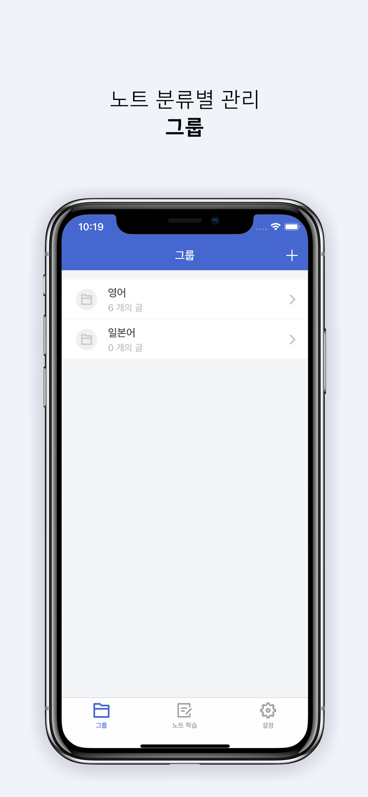
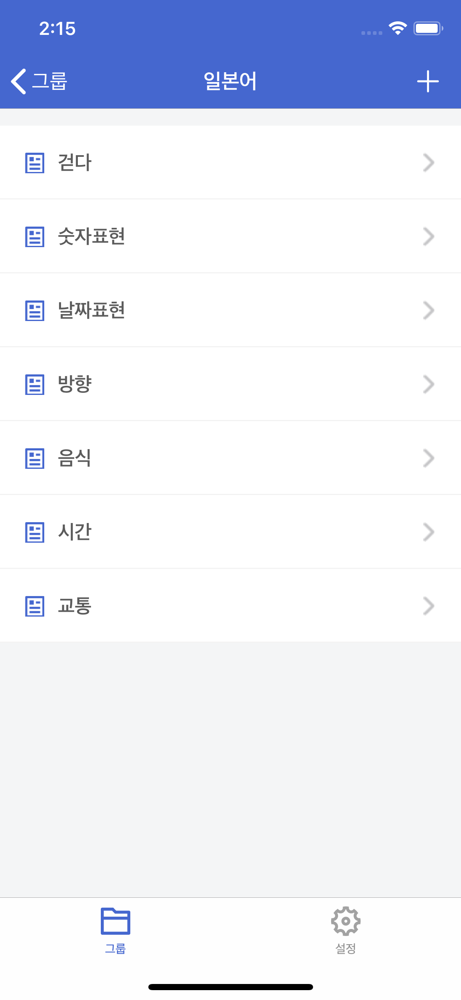
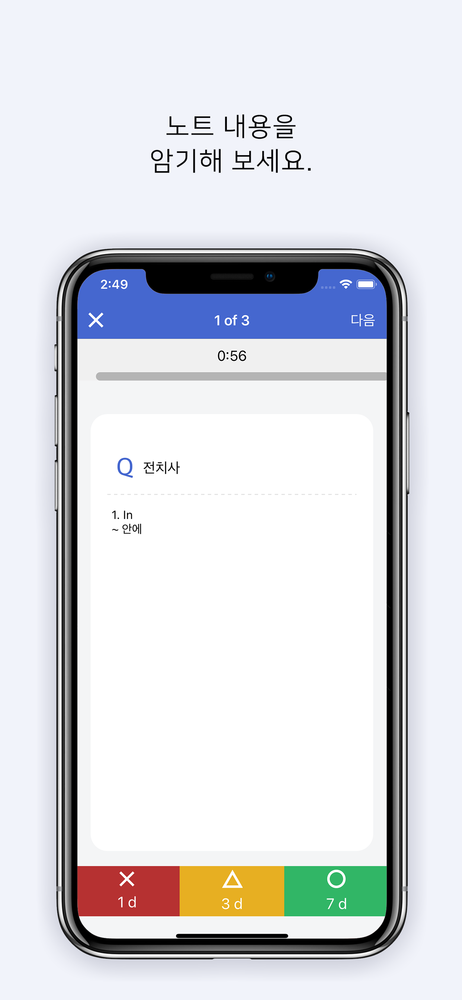

    
    <h1 style="text-align: center;">BitNote</h1>
    
    
    

BitNote는 백지 학습에서 아이디어를 얻어 만든 앱 입니다. 단어카드를 한장씩 넘겨가며 연관된 개념을 떠올리는 방식으로 학습을 할 수 있도록 도와줍니다. 

> 나만의 학습노트를 만들고, 백지학습법으로 공부해 보세요. 
>
> `Made by`: Sujin Jin(Rosa)
>
> `Develop`: 2021.02.15 ~ 2021.03.08
>
> `Release`: 2021.3.12

# 사용 방법

## 1. Group

- 그룹으로 노트를 묶어서 관리할 수 있습니다.
- 노트의 내용은 [텍스트, 이미지, URL]로 구성됩니다.
- 이미지는 사용자 라이브러리에서 불러오는 이미지와, 직접 그린 이미지로 등록이 가능합니다.
- 그룹을 오른쪽 으로 스와이프 하여, 수정, 삭제할 수 있습니다.

## 2. Note

    
    

- 그룹을 선택하면 하위 노트 리스트 화면으로 이동합니다.
- 노트를 오른쪽 으로 스와이프 하여, 공부완료했음을 체크할 수 있습니다.

## 3. 노트학습

### 3-1. 깜빡이 암기
- 공부할 그룹을 선택합니다.
- 선택한 그룹에 속한 노트들의 제목, 노트 내용을 하나씩 보여줍니다.
(노트의 내용이 없는 경우, 학습 기능을 사용할 수 없습니다.)
- 타이머 1분(기본값) 동안 노트내용이 하나씩 나타납니다.
다음 내용을 떠올려 보며, 암기해 보세요!

### 3-2. 백지학습
-  백지와 펜을 준비하세요.
- 공부할 그룹을 선택합니다. 
- 선택한 그룹에 속한 노트들의 제목을 하나씩 보여줍니다.
- 제목을 보고 생각나는 것들을 모두 백지에 적어보세요.
- 공부를 완료하면, 노트화면에서 복습횟수를 확인할 수 있습니다.

## 4. 복습
- 깜빡이 암기, 백지학습으로 공부한 노트를 N일 후에 복습할 수 있습니다.
- 각 노트의 이해 정도를 "적음, 중간, 많음" 으로 체크할 수 있습니다.
- 이해 정도에 따라, N일 후에 "복습" 버튼을 통해 복습할 수 있습니다.

|선택한 버튼|복습가능한 날짜|
|-|-|
|적음|1d(일) 후|
|중간|3d(일) 후|
|많음|7d(일) 후|

## 5. 설정
- 학습 타이머 ON,OFF: 백지학습에서 타이머 사용 여부를 체크
(깜빡이 암기기능 사용시, 타이머는 기본 적용됩니다)
- 노트 섞기: 노트 학습시, 랜덤한 순서로 노트를 보여줍니다.
- 문제당 시간: 각 문제의 시간 설정. (최대 60:00 까지)
